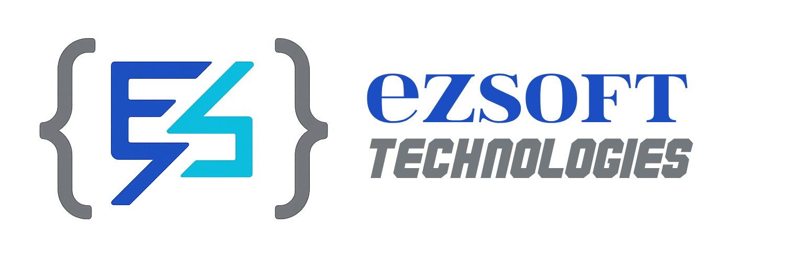

  

<h1 align="center">🚀 Turning Vision into Code</h1>

  
  
  
  
  

## 👋 Who We Are
**ezSoft Technologies Inc.** is a **Canadian software innovation partner** 🇨🇦 based in Montreal, dedicated to transforming ideas into scalable digital solutions. Since 2015, we’ve empowered businesses across North America with:

- **Tailored Development** 🛠️: Full-cycle development from MVP to enterprise systems  
- **Strategic Consulting** 📈: Architecture design, tech debt mitigation & digital transformation  
- **Flexible Delivery** 🌍: Dedicated remote teams or embedded on-site engineers  

## 🛠 Core Expertise
| **Frontend**                    | **Backend**                     | **Mobile**                      | **Cloud & DevOps**              |
|---------------------------------|---------------------------------|---------------------------------|---------------------------------|
| React • Vue • Angular           | Sprint Boot • Node.js • Python  | Flutter • KMM                   | AWS • Azure • GCP               |
| TypeScript • Tailwind CSS       | REST API • GraphQL              | SwiftUI • Jetpack Compose       | Docker • Kubernetes             |

## 🌟 Why Partner With Us?

  

- ✅ **Open Source Advocates**: Actively contribute to OSS ([Explore our public repos →](/projects))  
- ✅ **Transparent Workflow**: Real-time dashboards & agile sprints for full visibility  
- ✅ **Cost Efficiency**: Deliver projects **40% faster** with 30%+ cost savings vs. traditional models  
- ✅ **Enterprise-Grade Security**: GDPR/CCPA compliant, SOC 2 & ISO 27001 certified  

## 🤝 Let’s Build Together
**Explore our engagement models:**  
🔗 [Dedicated Teams](https://ezsoft.ca/teams) • [Project-Based Development](https://ezsoft.ca/projects) • [Consulting](https://ezsoft.ca/consulting)  

**Connect with us:**  
📧 [contact@ezsoft.ca](mailto:contact@ezsoft.ca) • 🌐 [ezsoft.ca](https://ezsoft.ca)  
💼 [LinkedIn](https://linkedin.com/company/ezsoft) • 🐦 [X/Twitter](https://twitter.com/ezsoft_dev) • 📰 [Blog](https://ezsoft.ca/blog)  

---

  <em>Proudly Canadian 🍁 • Committed to Open Innovation • Partnering Globally Since 2015</em>

